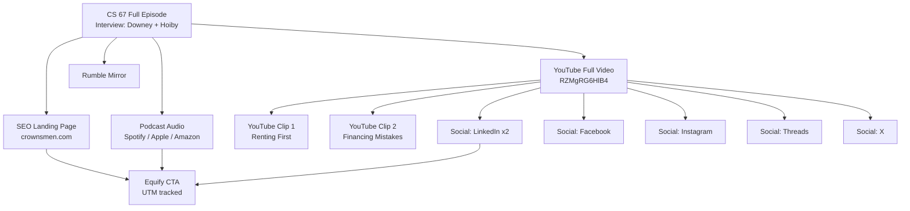

# Campaign Report: CS 67 — Equify Financial

**Report date:** July 31, 2026  
**Prepared for:** Crownsmen Partners / The Construction Show  
**Episode:** CS 67 — *Equify Financial: The Hidden Cash Inside Your Equipment Fleet*  
**Guest:** Patrick Hoiby, CEO, Equify Financial, LLC  
**Host:** Jerrod Downey, The Construction Show  

---

## Executive Summary

Crownsmen Partners published **CS 67**, a full-length episode of *The Construction Show* featuring Equify Financial CEO Patrick Hoiby on construction equipment financing, cash flow, and fleet equity. The campaign uses a **multi-platform distribution strategy**: one flagship long-form video, two YouTube Shorts/clips, podcast syndication across four audio platforms, a SEO-optimized landing page on crownsmen.com, and coordinated social posts on LinkedIn, Facebook, Instagram, Threads, and X.

The episode positions Equify Financial as a construction-specific financing partner — not a generic lender — and emphasizes unlocking hidden equity in paid-off equipment fleets, flexible working capital, and faster approvals aligned with project timelines. Sponsorship and partner integrations are consistent across all touchpoints, with tracked UTM links driving traffic to equifyfinancial.com.

---

## Campaign Asset Inventory

| # | Platform | Asset Type | URL | Status |
|---|----------|------------|-----|--------|
| 1 | YouTube | Full episode (#67) | [youtu.be/RZMgRG6HlB4](https://youtu.be/RZMgRG6HlB4) | Live — premiered May 27, 2026 |
| 2 | YouTube | Clip — renting before financing | [youtu.be/-y_KlhcE80k](https://youtu.be/-y_KlhcE80k) | Live |
| 3 | YouTube | Clip — financing mistakes | [youtu.be/cb6VcOTrP0w](https://youtu.be/cb6VcOTrP0w) | Live |
| 4 | Crownsmen.com | SEO landing page + embedded video | [crownsmen.com/equify-financial-construction-equipment-financing](https://www.crownsmen.com/equify-financial-construction-equipment-financing/) | Live — published May 27, 2026 |
| 5 | Spotify | Podcast episode | [open.spotify.com/episode/7HThkUd9VXWB6YlVPhWMyf](https://open.spotify.com/episode/7HThkUd9VXWB6YlVPhWMyf) | Live — May 28, 2026 (~59 min) |
| 6 | Apple Podcasts | Podcast episode | [podcasts.apple.com/.../i=1000769959116](https://podcasts.apple.com/us/podcast/cs-67-equify-financial-the-hidden-cash-inside-your/id1365112754?i=1000769959116) | Live — May 28, 2026 (59 min) |
| 7 | Amazon Music | Podcast episode | [music.amazon.com/.../1ff7e9f5-6893-408a-897d-35ef4b6ec88f](https://music.amazon.com/podcasts/c29d9c84-881d-4839-9bc4-d0d799cd3f3d/episodes/1ff7e9f5-6893-408a-897d-35ef4b6ec88f) | Live |
| 8 | Rumble | Full episode mirror | [rumble.com/v7ahm0u-...](https://rumble.com/v7ahm0u-equify-financial-the-hidden-cash-inside-your-equipment-fleet-67.html) | Live |
| 9 | LinkedIn | Crownsmen Partners post | [linkedin.com/.../7465509214887620608-0KPJ](https://www.linkedin.com/posts/crownsmen-partners_construction-financing-videoproduction-activity-7465509214887620608-0KPJ) | Live — ~2 months ago |
| 10 | LinkedIn | The Construction Show post | [linkedin.com/.../7465509590617567233-kFXM](https://www.linkedin.com/posts/the-construction-show_construction-financing-videoproduction-activity-7465509590617567233-kFXM) | Live — ~2 months ago |
| 11 | Facebook | Crownsmen Partners post | [facebook.com/crownsmenp/posts/...](https://web.facebook.com/crownsmenp/posts/pfbid037SHi69ck3KU6RorEvGyRTTPVfgkre7MSaYGqLnwSMR1ZmbGu9GxkzfeHAboVopnYl) | Live |
| 12 | Instagram | Post | [instagram.com/p/DY23oP2EyRY](https://www.instagram.com/p/DY23oP2EyRY/) | Live |
| 13 | Threads | Post | [threads.com/@crownsmenp/post/DY21qIfE1Wl](https://www.threads.com/@crownsmenp/post/DY21qIfE1Wl) | Live |
| 14 | X (Twitter) | Post | [x.com/CrownsmenP/status/2059746127554261099](https://x.com/CrownsmenP/status/2059746127554261099) | Live (metrics not accessible at report time) |

**Total tracked assets:** 14 URLs across 10 platforms.

---

## Content Overview

### Episode Details

| Field | Value |
|-------|-------|
| Series | The Construction Show (Crownsmen Partners) |
| Episode number | CS 67 |
| Title | Equify Financial: The Hidden Cash Inside Your Equipment Fleet |
| Runtime | ~59 minutes (58 min 45 sec on Spotify; 59 min on Apple Podcasts) |
| Premiere / publish | May 27–28, 2026 |
| Format | Video interview (also distributed as audio podcast) |
| Hashtags (social) | `#construction` `#financing` `#videoproduction` |

### Episode Description (canonical)

> In this episode of The Construction Show hosted by Jerrod Downey, guest Patrick Hoiby, CEO of Equify Financial, LLC, breaks down how construction companies can unlock smarter financing strategies through equipment finance, factoring, risk services, and technology-driven solutions. Instead of just "getting a loan," Patrick explains how businesses can leverage their existing assets, unlock hidden equity in their fleets, and build a stronger financial foundation for long-term growth — especially as infrastructure demand accelerates heading into 2026 and beyond.

### Key Themes Discussed

1. **Construction-specific financing** — Why generic lending products fail contractors; need for industry-aligned structures.
2. **Hidden fleet equity** — Paid-off equipment as a financial asset; refinancing and unlocking capital tied up in fleets.
3. **Cash flow management** — Project-based billing cycles, delayed payments, and working capital gaps.
4. **Heavy equipment financing** — Excavators, loaders, crushers, trucks, skid steers without draining cash reserves.
5. **Flexible financing programs** — Seasonal revenue, project schedules, and operational realities vs. rigid bank standards.
6. **Common contractor mistakes** — Over-reliance on a single lender; missing refinancing opportunities; poor timing on equipment purchases.
7. **Rent-to-finance strategy** — Why renting equipment first can improve future financing approval odds.
8. **Strategic growth** — Financing as a growth lever, not just a stopgap for cash shortages.

### Top Pain Points Addressed

| Problem | Episode Response |
|---------|------------------|
| Slow financing approvals | Fast, construction-aware underwriting |
| Limited access to capital | Fleet equity and working capital products |
| Rising equipment costs | Equipment loans/leases preserving cash reserves |
| Cash flow gaps | Factoring and flexible repayment structures |
| Missed growth opportunities | Scalable financing aligned with project pipelines |

---

## Video Distribution

### Full Episode (YouTube + Rumble)

| Platform | Title | URL |
|----------|-------|-----|
| YouTube (CrownsmenPartners) | Equify Financial: The Hidden Cash Inside Your Equipment Fleet #67 | [RZMgRG6HlB4](https://youtu.be/RZMgRG6HlB4) |
| Rumble | Equify Financial: The Hidden Cash Inside Your Equipment Fleet #67 | [v7ahm0u](https://rumble.com/v7ahm0u-equify-financial-the-hidden-cash-inside-your-equipment-fleet-67.html) |

- **Premiere date:** May 27, 2026  
- **Channel:** [@CrownsmenPartners](https://www.youtube.com/@CrownsmenPartners)  
- **Landing page embed:** YouTube video embedded on crownsmen.com with full SEO article (~2,500+ words)

### Short-Form Clips (YouTube)

Two derivative clips extend reach and target specific search/intent angles:

| Clip Title | URL | Topic Angle |
|------------|-----|-------------|
| Equify Financial Shares Why Renting Equipment First Improves Financing Approval | [youtu.be/-y_KlhcE80k](https://youtu.be/-y_KlhcE80k) | Rent-before-buy financing strategy |
| Equify Financial Talks About Equipment Financing Mistakes Contractors Make | [youtu.be/cb6VcOTrP0w](https://youtu.be/cb6VcOTrP0w) | Refinancing, single-lender risk, fleet as asset |

These clips are also promoted individually on LinkedIn (The Construction Show account) with separate watch links.

---

## Podcast / Audio Distribution

The episode is syndicated identically across major podcast platforms under the **Crownsmen Partners** feed:

| Platform | Episode ID / Link | Published | Length |
|----------|-------------------|-----------|--------|
| Spotify | [7HThkUd9VXWB6YlVPhWMyf](https://open.spotify.com/episode/7HThkUd9VXWB6YlVPhWMyf) | May 28, 2026 | 58 min 45 sec |
| Apple Podcasts | [i=1000769959116](https://podcasts.apple.com/us/podcast/cs-67-equify-financial-the-hidden-cash-inside-your/id1365112754?i=1000769959116) | May 28, 2026 06:29 UTC | 59 min |
| Amazon Music | [1ff7e9f5-6893-408a-897d-35ef4b6ec88f](https://music.amazon.com/podcasts/c29d9c84-881d-4839-9bc4-d0d799cd3f3d/episodes/1ff7e9f5-6893-408a-897d-35ef4b6ec88f) | May 2026 | ~59 min |
| Rumble (video) | [v7ahm0u](https://rumble.com/v7ahm0u-equify-financial-the-hidden-cash-inside-your-equipment-fleet-67.html) | May 2026 | ~59 min |

**Show metadata (Apple Podcasts):** Clean rating, weekly update frequency, episode 67 in series.

All podcast descriptions include sponsor blocks, partner links, and the Equify Financial CTA with UTM tracking.

---

## Social Media Distribution

### LinkedIn (2 posts — dual account strategy)

| Account | Followers | Post Focus | URL |
|---------|-----------|------------|-----|
| Crownsmen Partners | ~7,923 | Main episode promotion | [Post](https://www.linkedin.com/posts/crownsmen-partners_construction-financing-videoproduction-activity-7465509214887620608-0KPJ) |
| The Construction Show | ~1,662 | Episode + 2 clip promotions | [Post](https://www.linkedin.com/posts/the-construction-show_construction-financing-videoproduction-activity-7465509590617567233-kFXM) |

**Post copy highlights:**
- Headline hook: *"The Hidden Cash Inside Your Equipment Fleet"*
- Watch CTA with short links (lnkd.in/dMERdP48 for main episode; lnkd.in/dK_9sA4m for clips)
- Credit to Jacqueline Curb and Dennis Patterson for organizing the conversation
- Jerrod Downey commented on Crownsmen post: *"Great to have you on the show Patrick Hoiby!"*
- Full sponsor/partner acknowledgment block included in every post

### Other Social Platforms

| Platform | Account | Post URL | Notes |
|----------|---------|----------|-------|
| Facebook | @crownsmenp | [Post](https://web.facebook.com/crownsmenp/posts/pfbid037SHi69ck3KU6RorEvGyRTTPVfgkre7MSaYGqLnwSMR1ZmbGu9GxkzfeHAboVopnYl) | OG title matches episode name |
| Instagram | @crownsmenp | [DY23oP2EyRY](https://www.instagram.com/p/DY23oP2EyRY/) | Visual promotion |
| Threads | @crownsmenp | [DY21qIfE1Wl](https://www.threads.com/@crownsmenp/post/DY21qIfE1Wl) | Cross-post |
| X (Twitter) | @CrownsmenP | [Status 2059746127554261099](https://x.com/CrownsmenP/status/2059746127554261099) | Episode promotion |

**Social messaging consistency:** All platforms use the same core narrative — flexible construction financing, cash flow challenges, and Equify's industry-specific solutions. Hashtag set is uniform: `#construction #financing #videoproduction`.

---

## Website / SEO Landing Page

**URL:** [crownsmen.com/equify-financial-construction-equipment-financing](https://www.crownsmen.com/equify-financial-construction-equipment-financing/)

| Element | Detail |
|---------|--------|
| Publish date | May 27, 2026 |
| H1 | CS 67. Equify Financial: The Hidden Cash Inside Your Equipment Fleet |
| Embedded media | YouTube full episode (RZMgRG6HlB4) |
| Content depth | Long-form article with H2/H3 sections covering financing challenges, Equify solutions, contractor pain points, and growth strategies |
| Internal linking | Adjacent episodes: CS 66 (MB Crusher), CS 68 (Kenco Engineering) |
| Guest CTA block | Patrick Hoiby LinkedIn, Equify website, Equify YouTube |
| Equify tracking link | `equifyfinancial.com?utm_source=direct+buy&utm_medium=video&utm_campaign=crownsmen&utm_content=pat+hoiby+interview` |

The landing page functions as the **SEO hub** for the campaign, targeting keywords around construction financing, equipment loans, contractor cash flow, and fleet equity.

---

## Partners, Sponsors & Credits

### Voice of Industry Tour Partner
- **Savona Equipment** — [savonaequipment.com](https://www.savonaequipment.com/?utm_source=Email+&utm_medium=Email+&utm_campaign=Email+&utm_id=Savona+Equipment)

### Studio Sponsor
- **Sofvie Inc.** — [sofvie.com](https://sofvie.com/?utm_source=Crownsmen+Email+&utm_medium=Email+&utm_campaign=Email+&utm_id=Sofvie)

### Episode Sponsors
| Sponsor | Link |
|---------|------|
| Emesent | [hubs.li/Q042NGkF0](https://hubs.li/Q042NGkF0) |
| BOBYARD | [bit.ly/4swgH7n](https://bit.ly/4swgH7n) |
| MAJOR Wire (FLEX-MAT) | majorflexmat.com/contact/?utm_source=crownsmen2026&utm_medium=video&utm_campaign=conexpo_2026 |
| Hardox (SSAB) | campaign.ssab.com/conexpo26 |
| SMS Equipment | smsequipment.com (MINExpo AHS campaign UTM) |

### Production Team
| Role | Name |
|------|------|
| Host | [Jerrod Downey](https://www.linkedin.com/in/jerroddowney/) |
| Executive Producer | [Rory Bamford](https://ca.linkedin.com/in/rory-bamford-crownsmen) |
| Director / Co-Host | [Gaudy Molina](https://ca.linkedin.com/in/gaudy-molina-05074b139) |
| Guest | [Patrick Hoiby](https://www.linkedin.com/in/patrick-hoiby-3a63bba), CEO, Equify Financial |
| Conversation organizers | Jacqueline Curb, Dennis Patterson |

---

## Tracking & Attribution

Equify Financial uses a consistent UTM string across all campaign touchpoints:

```
https://equifyfinancial.com?utm_source=direct+buy&utm_medium=video&utm_campaign=crownsmen&utm_content=pat+hoiby+interview
```

| Parameter | Value | Implication |
|-----------|-------|-------------|
| utm_source | direct+buy | Direct/partnership channel |
| utm_medium | video | Video-first campaign |
| utm_campaign | crownsmen | Crownsmen partnership campaign |
| utm_content | pat+hoiby+interview | Guest-specific content attribution |

Individual sponsors carry their own UTM parameters (e.g., Savona Equipment email campaign, MAJOR Wire conexpo_2026, SMS Equipment MINExpo).

---

## Campaign Architecture



---

## Distribution Scorecard

| Category | Assets | Coverage |
|----------|--------|----------|
| Long-form video | 2 (YouTube + Rumble) | Strong |
| Short-form video | 2 YouTube clips | Good — topic-specific hooks |
| Podcast audio | 3 platforms (Spotify, Apple, Amazon) | Strong |
| Owned web / SEO | 1 landing page | Strong — deep content |
| Social promotion | 5 platforms, 6+ posts | Strong — dual LinkedIn accounts |
| Guest attribution | LinkedIn, website, YouTube links | Complete |
| Sponsor integration | Consistent across all descriptions | Complete |
| UTM tracking | Equify + individual sponsors | Complete |

---

## Observations & Recommendations

### Strengths

1. **Full-funnel distribution** — Video, audio, web, and social are all covered with consistent messaging.
2. **Clip strategy** — Two focused YouTube clips target distinct search intents (renting strategy, common mistakes), extending shelf life beyond the full episode.
3. **Dual LinkedIn presence** — Both Crownsmen Partners (~7.9K) and The Construction Show (~1.7K) amplify reach to different audience segments.
4. **SEO landing page** — Substantial written content supports organic discovery for construction financing keywords.
5. **Tracked CTAs** — UTM parameters on Equify links enable campaign ROI measurement.
6. **Sponsor consistency** — Partner blocks appear identically on podcast platforms, social posts, and the website.

### Opportunities

1. **Engagement metrics** — Public view counts, likes, and social engagement were not fully accessible at report time (platform restrictions). Recommend pulling native analytics from YouTube Studio, Spotify for Podcasters, LinkedIn analytics, and Meta Business Suite for a performance addendum.
2. **Clip link consistency** — LinkedIn clip posts on The Construction Show account both reference `lnkd.in/dK_9sA4m`; verify each clip has a unique tracked short link for attribution.
3. **X/Twitter metrics** — Post was live but blocked from automated retrieval; check X analytics dashboard directly.
4. **Cross-platform CTA** — Consider adding the crownsmen.com landing page link (not just YouTube) in social posts to capture SEO traffic and email signups.
5. **Repurposing** — Episode themes (fleet equity, rent-before-buy, single-lender risk) could support additional short-form content, quote cards, or blog snippets for ongoing organic reach.
6. **Guest amplification** — Confirm Equify Financial's LinkedIn and YouTube channels reshared the episode to their audience for extended reach.

---

## Appendix: All Source URLs

1. https://youtu.be/RZMgRG6HlB4  
2. https://youtu.be/-y_KlhcE80k  
3. https://youtu.be/cb6VcOTrP0w  
4. https://www.linkedin.com/posts/crownsmen-partners_construction-financing-videoproduction-activity-7465509214887620608-0KPJ  
5. https://www.linkedin.com/posts/the-construction-show_construction-financing-videoproduction-activity-7465509590617567233-kFXM  
6. https://web.facebook.com/crownsmenp/posts/pfbid037SHi69ck3KU6RorEvGyRTTPVfgkre7MSaYGqLnwSMR1ZmbGu9GxkzfeHAboVopnYl  
7. https://www.instagram.com/p/DY23oP2EyRY/  
8. https://www.threads.com/@crownsmenp/post/DY21qIfE1Wl  
9. https://x.com/CrownsmenP/status/2059746127554261099  
10. https://open.spotify.com/episode/7HThkUd9VXWB6YlVPhWMyf?si=4pK9_mMxTUa5PLQazCMBPg  
11. https://podcasts.apple.com/us/podcast/cs-67-equify-financial-the-hidden-cash-inside-your/id1365112754?i=1000769959116  
12. https://music.amazon.com/podcasts/c29d9c84-881d-4839-9bc4-d0d799cd3f3d/episodes/1ff7e9f5-6893-408a-897d-35ef4b6ec88f  
13. https://rumble.com/v7ahm0u-equify-financial-the-hidden-cash-inside-your-equipment-fleet-67.html  
14. https://www.crownsmen.com/equify-financial-construction-equipment-financing/  

---

*Report generated from publicly available content across all listed platforms. Engagement metrics should be supplemented with platform-native analytics dashboards for performance measurement.*
